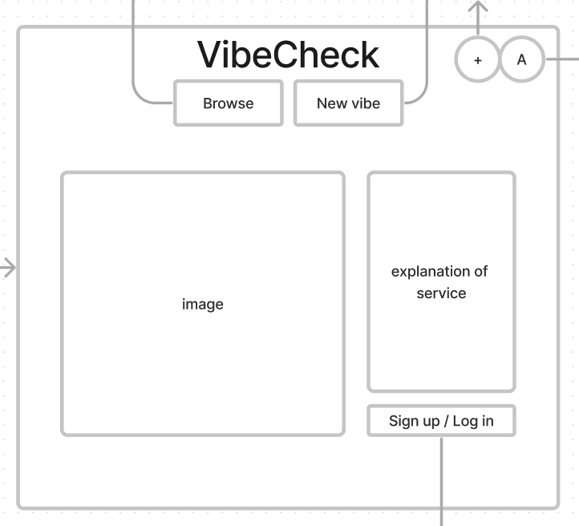

# Vibecheck
## Description
This was the second project completed as part of the General Assembly SEI Bootcamp. The goal of the project was to create a web app with full CRUD (create, read, update, delete) functionality while using Node.js and Express for the server, and MongoDB for the database.  As someone who really enjoys making lists and collating various data, I decided to make an app that allows users to create a moodboard using a diverse set of inputs - text, links, and images.

## Deployent link
The project is hosted [here](https://vibecheck.fly.dev/).

## Code Installation & Setup Guide

1. **Clone the Repository**  
   Firstly, you will need to clone the repository to your local machine. Open your terminal and run:  
   `git clone https://github.com/andy-ag/Vibecheck.git`  

2. **Navigate to the Project Directory**  
   `cd Vibecheck/vibecheck`  

3. **Install Dependencies**  
   You need to install the necessary packages for the app to run. Do this with npm (Node Package Manager):  
   `npm install`

4. **Google Cloud API**  
   For the Google OAuth functionality, you need to have a Google Cloud API account.
   - Go to [Google Cloud Console](https://console.cloud.google.com/).
   - Create a new project.
   - Navigate to **APIs & Services** -> **OAuth consent screen** and follow the steps to configure it.
   - Go to `Credentials` and create a new OAuth 2.0 client ID. 
   - Note down the Client ID and Client Secret.
   - Add `http://localhost:3000/oauth2callback` or another appropriate callback URL to the list of **Authorized redirect URIs**.

   <br/>

5. **Setup Environment Variables**  
   Create a `.env` file and fill in your environment variables.

   DATABASE_URL=Your MongoDB Connection String

   GOOGLE_CLIENT_ID=Your Google Client ID from step 4

   GOOGLE_SECRET=Your Google Client Secret from step 4

   GOOGLE_CALLBACK=http://localhost:3000/oauth2callback

   SECRET=Choose a secret string for session

   **Note the absence of string wrapping for the variables**

6. **Start the App**  
In your terminal, run the app using:  
`npm start`  
The app should now be running on `http://localhost:3000`.

7. **Enjoy!**  
You can now navigate to the app in your browser. If you encounter any issues, please report them on the GitHub repository.

## Timeframe and Working Team
This was a project that I worked on independently, with a time budget of one week.

## Technologies Used
This project used Node.js for the back-end, with Express as the chosen MVC framework. MongoDB was used for the database, and the front-end was done with HTML (EJS) / CSS (Bootstrap) / JavaScript.

## Brief
The technical requirements for the project can be found below. There were no restrictions on the subject and scope of the app.

The project **must**:
  - Have at least 2 data entities (data resources) in addition to the User Model - one entity that represents the main functional idea for your app and another with a One:Many or Many:Many relationship with that main entity (embedded or referenced).
  - Use OAuth authentication.
  - Implement basic authorization that restricts access to features that need a logged in user in order to work by "protecting" those routes from anonymous users.
  - Ensure that editing and deletion of a data resource can only be done by the user that created that data.
  - Have full-CRUD data operations somewhere within the app's features. 
  - Be styled such that the app looks and feels similar to apps we use on a daily basis - it should have a consistent and polished user interface.
  - Be deployed online.

## Planning
After thinking of the core idea, I wanted to come up with a list of features that a user would expect to see on such a platform. I knew that I wouldn’t have enough time to implement all of them (as that would mean developing a fully polished social-media app in one week by one relatively inexperienced person) but I still wanted to keep a subset of these features that ensured a satisfactory user experience, and also one that would stretch me from a technical standpoint (given the time budget).

After deciding on the appropriate feature set, I produced [wireframes](https://www.figma.com/file/sqwnkraKpymyWMleYBDVfQ/Project-2---VibeCheck?type=whiteboard&node-id=0-1&t=SD7iBezNYH2uh93s-0) and an ERD. The app ended up matching the wireframe quite closely, and the ERD only needed some minor tweaks to accommodate the specific implementation of the desired functionality that I ended up with.

<a href="https://i.imgur.com/GdSQsvT.png" target="_blank" rel="noopener noreferrer">ERD</a>:  
<!--  -->


models/user.js
```javascript
const mongoose = require('mongoose')
const Schema = mongoose.Schema

const userSchema = new Schema({
    googleId: {
        type: String,
        required: true
    },
    hasUsername: {
        type: Boolean,
        required: true
    },
    username: String,
    email: String,
    ownVibes: [{
        type: Schema.Types.ObjectId,
        ref: 'Vibe'
    }],
    likedVibes: [{
        type: Schema.Types.ObjectId,
        ref: 'Vibe'
    }]
}, {
    timestamps: true
})

module.exports  = mongoose.model('User', userSchema)
```

models/vibe.js
```javascript
const mongoose = require('mongoose')
const Schema = mongoose.Schema

const itemSchema = new Schema({
    itemId: {
        type: String,
        required: true
    },
    content: {
        type: String,
        required: true
    }
})

const vibeSchema = new Schema({
    name: {
        type: String,
        trim: true,
        maxlength: 100 
    },
    user: {
        type: Schema.Types.ObjectId,
        ref: 'User'
    },
    items: [ itemSchema ],
    likedBy: [{
        type: Schema.Types.ObjectId,
        ref: 'User'
    }]
}, {
    timestamps: true
})

module.exports = mongoose.model('Vibe', vibeSchema)
```

Landing page - <a href="https://i.imgur.com/5qhqpql.png" target="_blank" rel="noopener noreferrer">wireframe</a> / <a href="https://i.imgur.com/rxDDC5g.jpg" target="_blank" rel="noopener noreferrer">final</a>:

<!--   -->
 

Canvas - <a href="https://i.imgur.com/xMNMAqc.png" target="_blank" rel="noopener noreferrer">wireframe</a> / <a href="https://i.imgur.com/Y8ZGEkC.png" target="_blank" rel="noopener noreferrer">final</a>:

<!--   -->
 

Feed - <a href="https://i.imgur.com/F1arkTa.png" target="_blank" rel="noopener noreferrer">wireframe</a> / <a href="https://i.imgur.com/BoD3LZI.png" target="_blank" rel="noopener noreferrer">final</a>:

<!--   -->
 

## Build process
I started the project by creating a skeleton back-end structure - adding all the necessary routes, adding the controllers where it was a simple page render, and leaving controller templates where the action is complex (create, update actions). I then created basic ejs templates for all the required pages and populated them with the associated links. Having a fully navigable website structure from the get-go allowed me to keep testing the user experience throughout the various stages of the project.

The next step was implementing Google OAuth for the app using [passport](https://www.passportjs.org/). This also meant creating a User schema for my database.

```javascript
const userSchema = new Schema({
    googleId: {
        type: String,
        required: true
    },
    hasUsername: {
        type: Boolean,
        required: true
    },
    username: String,
    email: String,
    ownVibes: [{
        type: Schema.Types.ObjectId,
        ref: 'Vibe'
    }],
    likedVibes: [{
        type: Schema.Types.ObjectId,
        ref: 'Vibe'
    }]
}, {
    timestamps: true
})
```

I made the decision not to use users’ real names on the website, and instead ask them to create a unique username whenever they interacted with a feature that required it. The passport config and user creation code can be found below, followed by the authentication controller that handles this aspect of the app.

config/passport.js
```javascript
//! Passport module config for Google Authentication
const passport = require('passport')
const GoogleStrategy = require('passport-google-oauth').OAuth2Strategy
const User = require('../models/user');

passport.use(new GoogleStrategy(
    {
        clientID: process.env.GOOGLE_CLIENT_ID,
        clientSecret: process.env.GOOGLE_SECRET,
        callbackURL: process.env.GOOGLE_CALLBACK
      },
      async function(accessToken, refreshToken, profile, cb) {
        try {
            let user = await User.findOne({ googleId: profile.id })
            if (user) return cb(null, user)
            user = await User.create({
              googleId: profile.id,
              email: profile.emails[0].value,
              hasUsername: false,
              username: ''
            })
            return cb(null, user)
          } catch (err) {
            return cb(err)
          }
        }    
))

passport.serializeUser(function(user, cb) {
    cb(null, user._id)
  })

passport.deserializeUser(async function(userId, cb) {
    cb(null, await User.findById(userId))
  })
```

controllers/auth.js
```javascript
//! Manages control flow for authentication-related actions
const passport = require('passport')
const User = require('../models/user')

function loginPage (req, res) {
    res.render('auth/login', { title: 'Login'})
}

function callback(req, res, next) {
    passport.authenticate(
        'google',
        {
          successRedirect: req.session.ref || '/vibes',
          failureRedirect: '/auth/login',
        }
    )(req, res, next)
}

function login(req, res, next) {
    const referer = req.headers.referer
    req.session.ref = referer
    passport.authenticate('google', {
        scope: ['profile', 'email'],
      })(req, res, next)
}

function logout(req, res) {
    req.logout(() => {
        res.redirect('/vibes')
      })
}

function usernameSelection(req, res) {
    res.render('auth/username', {message: ''})
}

async function setUsername(req, res) {
    console.log(req.body.username)
    const user = await User.findById(res.locals.user._id)
    const checkTaken = await User.find({username: req.body.username})
    if (checkTaken.length === 0) {
        user.username = req.body.username
        user.hasUsername = true
        user.save()
        res.render('users/settings', {message: 'Username updated!'})
    } else {
        res.render('auth/username', {message: 'This username is already taken'})
    }
    
}

module.exports = {
    loginPage,
    callback,
    login,
    logout,
    usernameSelection,
    setUsername
}
```

The next order of business was creating the canvas functionality - the core element of the app. I wanted the user to first assemble all the relevant items within the DOM, and then collate and save it to the database once, upon completion.

To this end, I created a script that allowed items to be placed on the canvas, and then resized and moved. This ended up posing a formidable challenge to me, given the one-week time allowance, something that I will elaborate on in the next section.

I needed to use a package to aid me with the moving and resizing, and one that would allow me to constrain the items to be unable to leave the confines of the canvas. I ended up using [interact.js](https://interactjs.io/) as it offered an implementation of all the functions I needed, and was also very easy to use. One issue that I encountered was that I could not use the **require** method that I had been accustomed to using with the Node.js backend for a frontend script. For the sake of consistency, and also in the spirit of learning, I ended up using [Browserify](https://browserify.org/) to allow me to use **require**.

I implemented the ‘Vibe’ (the branded name for a user’s moodboard) and ‘Item’ classes and made them isomorphic to the database schemas used to house their contents, ensuring a simplicity of the save / retrieve process.

public/javascripts/canvas.js
```javascript
class Vibe{
  constructor(name) {
    this.name = name
    this.items = []
  }

  addItem(element) {
    this.items.unshift(new Item(element.id))
  }

  removeItem(element) {
    const removalIndex = this.items.findIndex(item => item.itemId === getNumericId(element))
    this.items.splice(removalIndex, 1)
  }

  getValues() {
    for (let item of this.items) {
      item.getValue()
    }
  }
}

class Item{
  constructor(itemId) {
    this.itemId = itemId
    this.content = null
  }

  getValue() {
    const element = document.getElementById(this.itemId)
    this.content = element.outerHTML
  }
}

async function saveVibe() {
  newVibe.getValues()
  try {
    const response = await fetch(saveUrl, {
      method: "POST",
      headers: {
        "Content-Type": "application/json"
      },
      redirect: 'follow',
      body: JSON.stringify(newVibe)
    })
    if (response.redirected) {
      window.location.href = response.url;
  }
  } catch (error) {
      console.log(error)
  }
}
```

After the canvas operator file was ready, I created the controller functions to save and delete the boards, shown below. Upon saving a board, the user is redirected to its page. Upon removal, a board must also be removed from both its creator’s boards field and all relevant users’ liked boards field.

controllers/vibes.js
```javascript
async function create (req, res) {
    try {
        req.body.user = req.user._id;
        const user = await User.findById(req.user._id)
        const vibe = await Vibe.create(req.body)
        user.ownVibes.unshift(vibe._id)
        await user.save()
        res.redirect(`/vibes/${vibe._id}`)
    } catch (error) {
        console.log(error)
        res.redirect('/vibes/new', { error })
    }
    
}

async function remove (req, res) {
    try {
        const referer = req.headers.referer
        const vibe = await Vibe.findById(req.params.id)
        const vibeid = vibe._id.toString()
        const user = await User.findById(vibe.user._id)
        const likedBy = await User.find({likedVibes: vibe._id})
        if (vibe.user._id.toString() !== res.locals.user._id.toString()) {
            req.method = 'GET'
            return res.redirect(referer)
        }
        await user.ownVibes.pull(vibe._id)
        await user.save()
        for (let i=0; i<likedBy.length; i++) {
            await User.findOneAndUpdate(
              { _id: likedBy[i]._id },
              { $pull: { likedVibes: vibe._id } }
            )
          }
        await vibe.deleteOne()
        req.method = 'GET'
        // Can't refer back to the vibe page since it has been deleted
        if (referer.includes(vibeid)) {
            res.redirect('/vibes')
        } else {
            res.redirect(referer)
        }
    } catch (error) {
        console.log(error)
        res.redirect('/vibes')
    }
}
```

I then proceeded to add the ability to edit one’s boards, with a script identical to the initial canvas one, with the difference being the parsing of the existing board contents into the relevant classes upon initialisation, rather than creating an empty one.

I then moved on to creating the pseudo-homepage - the browse feed - and displaying it inverse-chronological order (newest posts first).

controllers/vibes.js
```javascript
async function index (req, res) {
    try {
        const vibes = await Vibe.find({}).sort({createdAt: -1}).populate('user')
        res.render('vibes/index', {vibes: vibes })
    } catch (error) {
        console.log(error)
        res.redirect('/')
    }
}
```

As I implemented these features, I added the EJS and basic CSS to render the relevant pages. There are, in essence, two types of pages that show boards - the ‘show’ type (used for showing a single board, the home feed, a user’s own and liked boards respectively), and the ‘new’ type used when creating a new board, updating or cloning an existing board.

The EJS for the two archetypes can be seen below. The Bootstrap classes were added after the project deadline, as detailed in a later section.


views/vibes/show.ejs
```javascript
<%- include('../partials/header') %>
<main class="d-flex flex-column">
<title><%= vibe.name %> by <%= vibe.user.username %></title>    
<div class="d-flex flex-column justify-content-center mt-2">
    <div class="d-flex flex-row justify-content-start align-self-center align-items-center canvassize">
        <h3><%= vibe.name %> by <a href="/users/<%= vibe.user._id %>"><%= vibe.user.username %></a></h3>
    </div>

    <div id="vibe-buttons" class="d-flex flex-row justify-content-start align-items-center align-self-center canvassize">
    <% if (user) { %>
        <% if (vibe.likedBy.indexOf(user._id) === -1) { %>
        <form action="/vibes/<%= vibe._id %>/like?_method=PUT" method="POST">
            <button class="btn browse-button">LIKE</button>
        </form>
        <% } else { %>
        <form action="/vibes/<%= vibe._id %>/like?_method=PUT" method="POST">
            <button class="btn browse-button">UNLIKE</button>
        </form>
        <% } %>
        <form action="/vibes/<%= vibe._id %>/clone" method="GET">
            <button class="btn browse-button">CLONE</button>
        </form>
    <% } %>
    <% if (user && user._id.toString() === vibe.user._id.toString()) { %>
        <form action="/vibes/<%= vibe._id %>/edit" method="GET">
            <button class="btn browse-button">EDIT</button>
        </form>
        <form action="/vibes/<%= vibe._id %>?_method=DELETE" method="POST">
            <button class="btn browse-button">DELETE</button>
        </form>
    <% } %>
    </div>

    <div id="canvas" class="container">
     <% for (let item of vibe.items) { %>
            <%- item.content %>
        <% } %>
    </div>
</div>
    
<%- include('../partials/footer') %>
```

views/vibes/show.ejs
```javascript
<%- include('../partials/header') %>
<main class="d-flex flex-column">
<script src="/javascripts/resizeDrag.js" defer></script>
<script src="/javascripts/canvas.js" defer></script>
<title>New vibe</title>

<div class="d-flex flex-column justify-content-center mt-2">
    <div id="name-change" class="d-flex flex-row justify-content-start align-self-center align-items-center canvassize">
        <form onkeydown="return event.key != 'Enter';">
            <input type="text" id="vibename" maxlength="100">
            <button id="vibename-submit" type="button" class="btn browse-button">Update name</button>
        </form>
        <h1 id="vibename-h1">What's the vibe?</h1>
    </div> 

    <div id="vibe-buttons" class="d-flex flex-row justify-content-start align-items-center align-self-center canvassize">
        <button id="image" class="btn browse-button">Image</button>
        <button id="text" class="btn browse-button">Text</button>
        <button id="link" class="btn browse-button">Link</button>
        <button id="toggle-headers" class="btn browse-button">Toggle headers</button>
        <button id="save" class="btn browse-button">SAVE</button>
    </div>

    <div id="canvas" class="container">
        <div id="image-popup">
            Provide url of image to be added
            <div id="add-url" input type="text" contenteditable="true"></div>
            <div class="wrapper" style="gap: 10px">
                <button id="cancel-image" class="btn browse-button">Cancel</button>
                <button id="submit-image" class="btn browse-button">Add</button>
            </div>  
        </div>

        <div id="link-popup">
            Provide url of link to be added
            <div id="add-link" input type="text" contenteditable="true"></div>
            Provide text to display (optional)
            <div id="link-text" input type="text" contenteditable="true"></div>
            <div class="wrapper" style="gap: 10px">
                <button id="cancel-link" class="btn browse-button">Cancel</button>
                <button id="submit-link" class="btn browse-button">Add</button>
            </div>
        </div>
    </div>
</div>
<%- include('../partials/footer') %>
```

After the core functionality of the app was done, I worked on finalising the styling of the app. I went for a minimalistic look, with a light neon colour palette, as this is an aesthetic direction that I am currently enjoying. While I wanted the app to have some character, I didn’t want the colours to be too overbearing. A user may want a different palette for their moodboard, so white and grey are ubiquitous throughout the website to foster this neutrality. 

An element of the front-end worth mentioning was the styling of the banner. I had recently looked at the use of small white tiling in interior design, and wanted to implement a banner in that style. I found a background image of white tiling in high quality, but the problem with it was that it was too zoomed in, and required the banner to be tiled (ha!) with multiple smaller versions. Having a fixed number of these tiled would mean that they would get stretched in a visually displeasing way on different screen sizes. The solution was to tile them dynamically, based on a ‘nice’ number of tiles as seen on my own screen.

public/javascripts/bannerStyling.js
```javascript
const tiling_src = 'https://1.bp.blogspot.com/-JKIEUkNZ3NQ/Xdp0zbaStpI/AAAAAAAAMQQ/a5kMu4CVlkYbHgO3AbU9fwEW_JPXRHvhgCEwYBhgL/s1600/tiles_seamless_simple_white_texture.jpg'
const body = document.body
const banner = document.getElementById('banner')
const height = extractNumbers(banner.style.height)
const native_dimension = 650
const originalWidth = 1800
const ratio = originalWidth/14
let screenWidth = window.innerWidth

const violet = 'rgb(187, 186, 255)'

window.addEventListener('resize', createTiling)
banner.style.boxShadow = `0 0 20px 0 ${violet}`

createTiling()

function columnCalculator(width) {
    return Math.round(width/ratio)
}

function createTiling() {
    removeImages()
    const newWidth = window.innerWidth
    const cols = columnCalculator(newWidth)
    banner.style.gridTemplateRows = 'repeat(1, 1fr)'
    banner.style.gridTemplateColumns = `repeat(${cols}, 1fr)`
    for (let i=0; i<cols; i++) {
        const image = document.createElement('img')
        image.src = tiling_src
        image.style.height = '125px'
        image.style.width = '100%';
        banner.appendChild(image) 
    }
}

function extractNumbers(string) {
    return string.replace(/\D/g, '')
}

function removeImages() {
    document.querySelectorAll("#banner img").forEach(img => img.remove());
}
```

Once the styling was done to an acceptable standard, I used the remaining time to implement the stretch goals that I didn’t manage to hit simultaneously with building out the essentials - liking other users’ boards (I had already created the skeleton to add this, but it was initially seen as a bonus task), the ability to change username, and smooth routing with dynamic redirects. I am personally a big believer of ‘function over form’ when using any service, and so made a deliberate choice to lean towards having more features within the feature volume / design quality dichotomy.

## Challenges
The biggest challenge this project posed was not a specific technical one, but rather the interplay between its scoping / planning, and the time-management of the actual execution. I wanted the project to be an app that someone could plausibly want to use, rather than a purely toy example that has strictly superior existing alternatives.

This led me to scope quite a lot of features, some with a non-trivial complexity of implementation, despite the strict deadline on the project. What compounded the issue was the fact that I was implementing many of the features for the first time, introducing uncertainty as to how much time should be budgeted for each at the outset.

The core feature of the app is a good example of all of the above - I wanted a user to be able to freely drag and resize all the items on their canvas, while also ensuring that they are unable to leave its bounds. Since I had limited experience in using front-end packages (and hence found it harder to provide a rough estimate of how long set-up and reading documentation takes), I didn’t think it would be **that** hard to code this in vanilla JS, and was up for a challenge even if it was, I attempted to implement this functionality myself.

While I did get aspects of it working (moving and resizing), it was clunky at best, and restricting the item to the canvas proved to be harder than expected. Ultimately I had to bite the bullet and use an existing package, after sinking a considerable amount of time into my own attempts, time that could have been used with much greater profit elsewhere.

I encountered similar issues in the styling process. As I had scoped a lot of back-end features, I found myself short on remaining time. I resorted to the familiar foe of vanilla CSS to avoid having to use Bootstrap for the first time, since I was once again uncertain as to how steep its learning curve is. The final product was passable, but far from refined, and actually ended up being more resource intensive than if I had committed to using Bootstrap. Ironically, I ended up using it anyway to re-style my project after it had been marked by the bootcamp’s teaching staff. It was indeed much more effective.

I did end up resolving each of these challenges, by course-correcting in good time and committing to a globally suboptimal strategy respectively, but learned a valuable lesson on scoping and planning in the process.

## Wins
The biggest win of the project was hitting multiple stretch goals beyond implementing the core functionality - the ability to create and change a username, to like and clone boards, to visit other users’ profiles and see the boards that they liked, and several more. In only one week, I managed to create a functioning social media app (albeit one that is still fairly raw), and started to add polishing touches to it.

Given that this was my first ever full-stack project, and that many features of the app were ones that I had never implemented before, I am satisfied with the end product. I also managed to adhere very closely to the wireframe and ERD, a win for my planning ability.

From a back-end standpoint, the user-friendly routing was a feature I particularly enjoyed implementing - using helper functions within the routers to check for users being signed-in and having an associated username when these were required, and redirecting accordingly; having dynamic redirects based on the user’s current page, rather than static ones. This part of the project really appealed to my love for optimality and clean organisation.

Lastly, the implementation of the board saving / retrieving process was quite elegant. When creating a board, a user creates an instance of a board class within the DOM that is isomorphic to the board schema in the MongoDB database, making the saving process a matter of calling a sparse fetch function. The board elements’ information was stored by saving their raw HTML, and hence the retrieval process is just a matter of reconstructing these elements from the HTML, guaranteeing identical I/O.

## Key Learnings/Takeaways
From a technical standpoint, as the project progressed I grew ever more confident in my understanding of the MVC framework, as well as the specific ways to interact with it using Express. I am much more comfortable with manipulating the flow of information within a server, and have also gained valuable hands-on experience in setting up and using a MongoDB database. I have also seen the power of Bootstrap in saving time and creating flexible, responsive page layouts, and gained experience in using an assortment of third-party packages, some with relatively labour-intensive set-up requirements.

At a higher-level, I learned how important scoping and planning are for a project, especially one with many moving parts. The balance between implementing the features you really want to see and actually having enough time to do so is a fine one, and I look forward to being able to craft increasingly precise plans as I gain more experience.

## Bugs
When updating a moodboard, a redirect loop is initiated upon the first press of the UPDATE button. Pressing the button a second time resolves the issue and the app proceeds to work as intended, but that is a non-obvious and non-user-friendly solution, and leaves the issue as an important one to be addressed.

## Future Improvements
The first improvement to be made to the project is the functionality that would scale the various canvases that can be encountered on the site depending on the user’s screen size, inclusive of the elements within them. At the moment, the canvases are responsive, but the elements inside are not. This noticeably dents the user experience, and makes the app stand out as a work in progress.

Another core improvement lies in enhancing the smoothness of all canvas-modifying operations. The current functionality is quite finicky for all the basic actions a user can take once an item has been placed on the canvas - moving, resizing, removing. Revamping these to be more intuitive and less demanding of close control by the user would go a long way to improving the overall feel of the app, and would boost the odds of converting one-time visitors to recurring users.

In terms of additional functionality, a clear next step would be to use APIs that would allow the user to search for and add content (music, books, films etc.) to their moodboard without leaving the page. The first candidate for this would be Spotify, as the API is known to be quite friendly, and the widgets that can be added are aesthetically pleasing, in alignment with the purpose of the app. Music is also (in my humble opinion) a cornerstone of the project’s idea - creating and sharing a set of eclectic associations. Adding a native way to interact with musical content (rather than using links as it can be done currently) would constitute a vast improvement of the app.

Another key feature currently missing is messaging between users. The ostensible purpose of the website is for people to share their creations (for those who may want to use the app to create private moodboards, a private / public board option is also something that I would like to implement), and it is only logical to extend the scope of possible interactions between people with similar interests (or differing interests that nevertheless sparked some curiosity). 

To that extent, another desirable feature would be the ability to add tags to your boards, as well as a search function that would retrieve boards with a given tag. This would also push the app closer in line with a contemporary user’s expectations.

Finally, the user experience can be improved by creating the ability to register with a username / password combo (for users who are reluctant to associate their main accounts with potentially untrustworthy websites, or for those who prefer to preserve maximum anonymity), and by adding more OAuth options, with an associated login possibility for each of the APIs used (as authentication for those may be required anyway to access user-specific info such as playlists or reading lists).